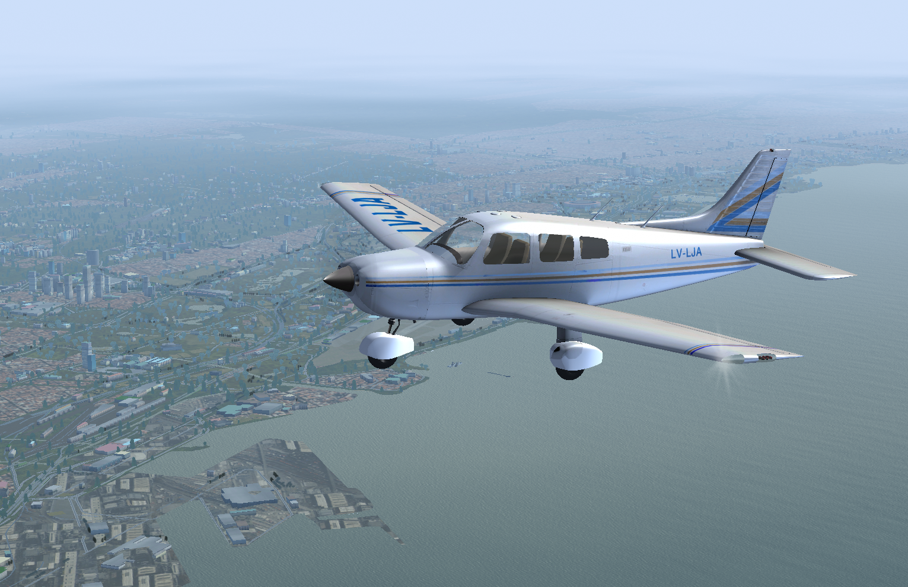
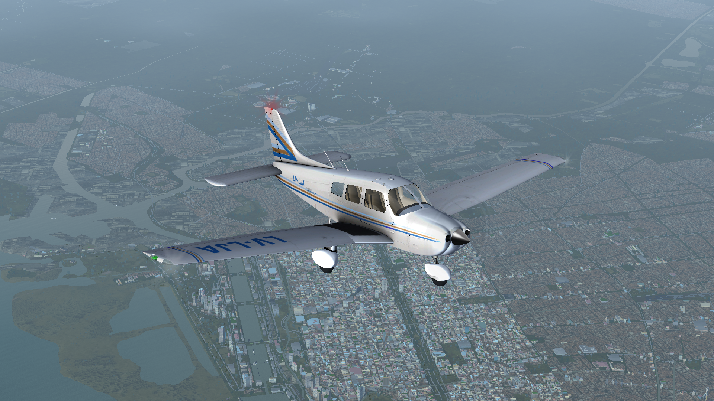

# Chincul Piper Archer Pa-28-181 Archer II LV-LJA (c.1997 livery)

A livery and sound mod for the zlsa's piper-archer for the Flightgear free flight simulator.
Original: https://zlsa.github.io/piper-archer/

